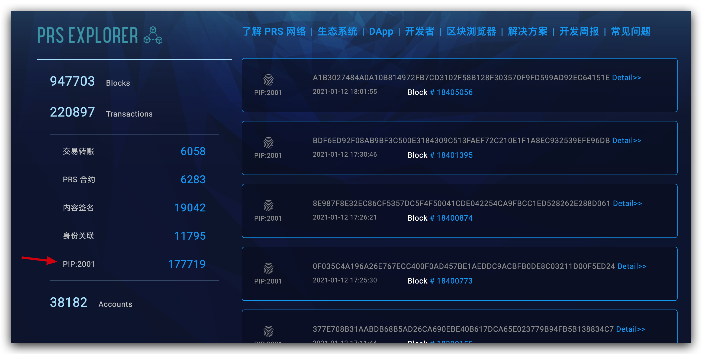
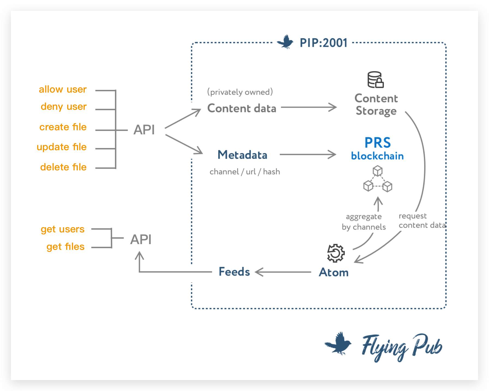

# 介绍

## 什么情况下，我需要了解 PIP2001 协议？

如果你自己开发的一个产品，想要把内容提交到 PRS 链上，那么你就需要了解 PIP2001 协议。

## 什么是 PIP2001 协议？

PIP2001 是 PRS 链上的一种区块类型。



PIP2001 协议规定了 PIP2001 区块的格式，以及如何提交，如何同步。

这个协议的目的就是为了让你方便地内容提交到链上、然后再把链上的内容同步下来。



图中黄色字体的部分就是你和 PRS 链交互的 API 方法。它们的含义分别是：

- allow user：允许一个用户往你的站点发文章
- deny user：禁止一个用户往你的站点发文章
- create file：创建一个文件
- update file：更新一个文件
- delete file：删除一个文件
- get users：获取我的站点所有的用户
- get files：获取我的站点所有的文件

每个方法的使用在后面的章节会有详细的介绍。

## PIP2001 和飞帖的关系是什么？

飞帖就是使用 PIP2001 协议开发的一个应用。

你可以把飞帖看做是 PIP2001 协议的 Demo 示例。

## 提交 PIP2001 区块需要付费吗？

当前每篇文章的上链手续费预估是 0.13 PRS。少量 PRS 即可支撑应用运行较长时间。

当你的应用已经发布上线时，可向 PRS 项目方申领应用数据上链手续费的补贴。

申请方式，发送邮件给：apply@press.one

邮件标题：应用上链手续费补贴申请 xxx.yyy.zzz（即你的应用域名）

邮件内容：
应用

```
申请人 mixin ID：123456（用于接收你的PRS补贴）

应用域名：xxx.yyy.zzz

应用简介：你的应用定位/简介，应用所属团队/个人简介等。
```

我们将持续关注你的应用数据情况，并自行决定你的补贴额度。该补贴仅可用于支付应用数据上链的手续费，不可挪作他用。如果你的应用数据不健康，或你把补贴挪作他用，我们将拒绝你的后续补贴申请。

当你的应用数据量较大，既往补贴即将用完，可再次向我们发起补贴申请。

接下来，我们进入下一个章节：[如何免费注册开发者账号？](/PIP2001/如何免费注册开发者账号？)
