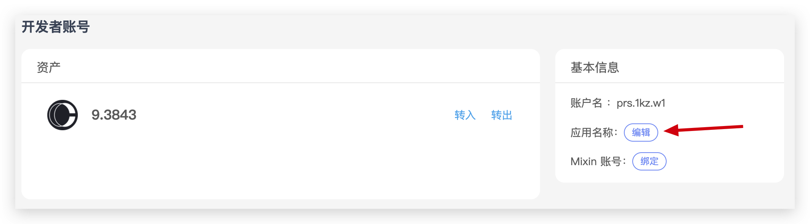

# 如何免费注册开发者账号？

## 免费注册开发者账号

打开 PRS ATM，免费注册开发者账号

## 设置应用名称

给你的站点起一个名字，方便我们在区块浏览器可以显示站点的名称

## 查看密钥

这 3 个字段，就是你这个开发者账号在提交区块时，需要用到的全部数据。

你注册了开发者账号，你就相当于在 PRS 链上注册了一个站点。

你用开发者账号的密钥来提交区块，就是给你的站点提交区块。

所以接下来，我们进入[如何提交 PIP2001 区块？](/PIP2001/如何提交PIP2001区块？)的部分，让我们使用这些数据，往 PRS 链提交区块
