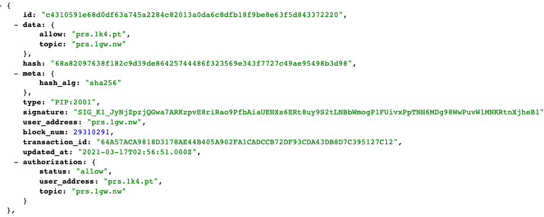
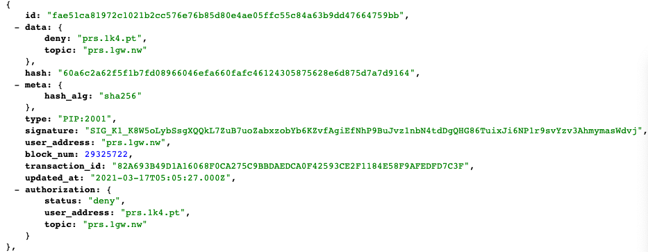

# 如何提交 PIP2001 区块？

这篇教程会给你介绍 PIP2001 都有哪些区块？作用是什么？如何提交？

## 简单总结一下，开发者账户和 Dapp 自身的用户之间，是什么关系？

1. 你在 PRS 链上注册了一个开发者账户（上一步已经注册好了）
2. 假设你的应用有 1000 个用户，那么你需要给这 1000 个用户分别注册一个链上账户
3. 你用开发者账户帮每个用户代签文章、发布区块
4. 所有上链的费用都由开发者账户承担

## 那我的用户就不需要支付上链费用？

对，因为让每个用户都支付上链费用是不现实的，这就相当于要求所有用户，在发文章之前，都得先有 PRS 才能上链，这就提高了门槛。

所以我们建议用代签的模式。开发者垫付 PRS 上链费用，然后你可以根据产品的需要，向用户进行二次收费。

## 给一个实际业务场景的例子？

1. 用户在你的应用注册登录，你就给 Ta 创建一个链上账户，然后为 Ta 发送一个【授权区块】，允许 Ta 可以向你的站点提交文章
2. 用户发布文章，就是提交一个【新建文章区块】
3. 用户修改文章，就是提交一个【修改文章区块】
4. 用户删除文章，就是提交一个【删除文章区块】
5. 如果用户发布很多不合适的内容，那就提交一个【取消授权区块】，把用户的内容从站点中剔除

下面我们根据上面的业务场景，一步一步使用 `prs-atm` 这个库来提交各种区块。

## 为你的用户注册链上账户

```javascript
const prsAtm = require('prs-atm');
(async () => {
  const accountKeystorePassword = '94235cf6327adb82';
  const keystore = await prsAtm.wallet.createKeystore(accountKeystorePassword);
  const { publickey, privatekey } = prsAtm.wallet.recoverPrivateKey(
    accountKeystorePassword,
    keystore
  );
  const freeAccount = await prsAtm.atm.openFreeAccount(publickey, privatekey);
  console.log({
    publicKey: publickey,
    privateKey: privatekey,
    address: freeAccount.account,
  });
})();
```

```javascript
{
  account: "prs.1k4.pt",
  publicKey: "EOS6tgApFRFRXeu4YLs9xzSszv7CJApXYiRpRqDWXMYYeN8ZEcajp",
  privateKey: "5KSphtHEqZ7T2YYPiP5UPpbkdaYoD7zoduJzpyg7Uz36LF8gZx7"
}
```

`accountKeystorePassword` 就是随机的字符串，你需要生成一个，然后放在配置文件中，每次注册链上账户，都可以使用这个密码。

你需要把这 3 个数据保存到用户的数据中，当用户需要发布区块时，就需要使用这些数据，来完成签名操作。

privateKey 建议不要明文保存在数据库中，要加密后保存。

## 授权区块，允许一个用户向你的站点提交文章

接下来，我们给这个用户发布一个授权区块，允许它向你的站点提交文章

我们把开发者账号，用户账号都临时保存到一个变量里面，方便接下来演示

```javascript
const developer = {
  account: 'prs.1gw.nw',
  publicKey: 'EOS6RybF7Bb11xfMfhiy4sVJLuYW6Pe2bkVyctXfso2webXYmXAGe',
  privateKey: '5K9bPkXAgdegw6DYAZu6XEaN1okaFzhRhDVhab6v4RYES2B1XdA',
};
const user = {
  account: 'prs.1k4.pt',
  publicKey: 'EOS6tgApFRFRXeu4YLs9xzSszv7CJApXYiRpRqDWXMYYeN8ZEcajp',
  privateKey: '5KSphtHEqZ7T2YYPiP5UPpbkdaYoD7zoduJzpyg7Uz36LF8gZx7',
};
```

```javascript
const prsAtm = require('prs-atm');
(async () => {
  const payload = {
    type: 'PIP:2001',
    meta: {},
    data: {
      allow: user.account,
      topic: developer.account,
    },
  };
  const resp = await prsAtm.prsc.signSave(
    payload.type,
    payload.meta,
    payload.data,
    developer.account,
    developer.publicKey,
    developer.privateKey,
    {
      userAddress: developer.account,
      privateKey: developer.privateKey,
    }
  );
  const blockData = resp.processed.action_traces[0].act.data;
  const block = {
    id: blockData.id,
    user_address: blockData.user_address,
    type: blockData.type,
    meta: blockData.meta,
    data: blockData.data,
    hash: blockData.hash,
    signature: blockData.signature,
    blockNum: null,
    blockTransactionId: resp.transaction_id,
  };
  console.log({ block });
  // 把 block 保存到你的数据库中
})();
```

打印的 block 结果

```javascript
{
  block: {
    id: 'c4310591e68d0df63a745a2284c82013a0da6c8dfb18f9be8e63f5d843372220',
    user_address: 'prs.1gw.nw',
    type: 'PIP:2001',
    meta: '{"hash_alg":"sha256"}',
    data: '{"allow":"prs.1k4.pt","topic":"prs.1gw.nw"}',
    hash: '68a82097638f182c9d39de86425744486f323569e343f7727c49ae95498b3d98',
    signature: 'SIG_K1_JyNjZpzjQGwa7ARKzpvE8riRao9PfbAiaUEHXs6ERt8uy9S2tLNBbWmogP1FUivxPpTNH6MDg98WwPuvW1MNKRtnXjheB1',
    blockNum: null,
    blockTransactionId: '64a57aca9818d3178ae44b405a902fa1cadccb72df93cda43db8d7c395127c12'
  }
}
```

每个字段的含义

| 字段               | 含义                                                                                         |
| ------------------ | -------------------------------------------------------------------------------------------- |
| id                 | 区块的 id                                                                                    |
| user_address       | 是哪个账户发的区块                                                                           |
| type               | 区块类型                                                                                     |
| meta               | 描述这个区块的元数据，hash_alg 表示使用什么哈希算法                                          |
| data               | 区块的内容，topic 是你的开发者账户名，也代表了你的站点，allow 是允许这个用户往你的站点发内容 |
| hash               | 区块的哈希                                                                                   |
| signature          | 区块的签名                                                                                   |
| blockNum           | 区块数，由于我们刚刚才提交了区块，还没有上链完成，所以目前拿不到这个，上链之后才能拿到       |
| blockTransactionId | 区块交易 id                                                                                  |

### 如何验证这个区块已经上链完成了呢？

我们可以从 PRS ATM 从找到站点的数据同步 API


访问【从链上读取用户列表】的 API，查看结果是否已经有了刚刚允许的用户，如果有，就说明授权区块上链完成了

[https://prs-bp-cn1.xue.cn/api/pip2001/prs.1gw.nw/authorization](https://prs-bp-cn1.xue.cn/api/pip2001/prs.1gw.nw/authorization)



可以看到，`prs.1k4.pt` 这用户已经在结果里面了，说明授权完成了。

在结果中，`tx_id` 就是 `block.id`，你可以根据这个，更新你数据库中的 block，从而表示这个 block 是已上链的了。

## 新建文章区块

```javascript
const prsAtm = require("prs-atm");
(async () => {
  const fileContent = 'hello world';
  const payload = {
    type: 'PIP:2001',
    meta = {
      uris: ['https://static-assets.xue.cn/api/storage/6713613aaddd8a511e6c26fea92decbcf71a7ba871bfd3a83ff5e6a781ce24bf.md'],
      mime: `text/markdown;charset=UTF-8`,
      encryption: 'aes-256-cbc',
      payment_url: `mixin://transfer/${mixinUserUuid}`,
    },
    data: {
      file_hash: prsAtm.encryption.hash(fileContent),
      topic: developer.account
    }
  }
  const resp = await prsAtm.prsc.signSave(
    payload.type,
    payload.meta,
    payload.data,
    developer.account,
    developer.publicKey,
    developer.privateKey,
    {
      userAddress: user.account,
      privateKey: user.privateKey
    }
  );
  const blockData = resp.processed.action_traces[0].act.data;
  const block = {
    id: blockData.id,
    user_address: blockData.user_address,
    type: blockData.type,
    meta: blockData.meta,
    data: blockData.data,
    hash: blockData.hash,
    signature: blockData.signature,
    blockNum: null,
    blockTransactionId: resp.transaction_id
  };
  console.log({ block });
  // 把 block 保存到你的数据库中
})();
```

打印的 block 结果

```javascript
{
  block: {
    id: '5eefab8d7067384286d729e68b3ce4e322d8ef99edd58466b90196543b7f3bee',
    user_address: 'prs.1k4.pt',
    type: 'PIP:2001',
    meta: '{"uris":["https://static-assets.xue.cn/api/storage/6713613aaddd8a511e6c26fea92decbcf71a7ba871bfd3a83ff5e6a781ce24bf.md"],"mime":"text/markdown;charset=UTF-8","encryption":"aes-256-cbc","payment_url":"mixin://transfer/127d626f-7116-3745-813d-0d234d9065f3","hash_alg":"sha256"}',
    data: '{"file_hash":"6713613aaddd8a511e6c26fea92decbcf71a7ba871bfd3a83ff5e6a781ce24bf","topic":"prs.1gw.nw"}',
    hash: 'aa83be1382d60284723054fd445a44161c578761244f8206eda9b3d0e4dbf028',
    signature: 'SIG_K1_KYaobDxte11MxNRYKufrhUP8SnpWuxSoo2358hUgedfKkaFhGU6B2PseVNrGyDyzikZQRg6AqgwS421N8zTARNP18TrWvP',
    blockNum: null,
    blockTransactionId: '0c26a58c34c812de8b0c2fc357b271c928578660a6067172aecdd22e07bf0634'
  }
}
```

大部分字段和授权区块是一样的，下面我为你介绍那些不一样的字段

| 字段             | 含义                                                                                                                                     |
| ---------------- | ---------------------------------------------------------------------------------------------------------------------------------------- |
| meta.uris        | 这篇文章的储存地址，PRS 只储存哈希，不储存内容，你需要自己储存文章，而且得是公开可访问的                                                 |
| meta.mime        | 文件类型                                                                                                                                 |
| meta.encryption  | 文件的加密算法                                                                                                                           |
| meta.payment_url | Mixin 收款地址，执行合约交易时，会用这个来收款，mixinUserUuid 就是这个用户的钱包 id，你需要为 Ta 生成一个 mixin 钱包，然后把 id 填到这里 |
| meta.hash_alg    | 使用什么哈希算法                                                                                                                         |
| data.file_hash   | 文件的哈希                                                                                                                               |
| data.topic       | 发送到哪个站点                                                                                                                           |

### block 和 file 是什么关系？

在上面的例子中，我们把文件（file）包裹在区块（block）里面，然后发布到链上。他们之间的关系就好像：比特币的一个区块，包含了很多笔交易，在 PIP2001 协议就是一个区块包含多个文件。我们把文件包裹在区块中。当然协议是支持一个区块包含多个文件的。不过一般情况下，我们推荐一个区块包裹一个文件，一对一的关系。

打个比喻，你可以理解为一个区块就是火车的一节车厢，而文件就是车厢里面的乘客。

### encryption 是什么作用？

如果你的内容是私密的、或者是需要付费才能阅读的，你不想把明文公开发布到链上。那么你可以先加密文章的内容，然后把加密后的文章发布到链上。

用什么加密算法都可以，根据你的需要来。

最后提交区块的时候，建议把使用的加密算法填到 `encryption` 字段中。

这样你或者别人在解析区块数据的时候，就能知道内容是否加密了，用什么算法解密的，应该如何解密。

### 如何验证这个区块已经上链完成了呢？

我们可以从 PRS ATM 找到站点的数据同步 API


访问【从链上读取文章列表】的 API，查看结果是否已经有了刚刚发送的文章，如果有，就说明文章区块上链完成了

[https://prs-bp-cn1.xue.cn/api/pip2001?topic=prs.1gw.nw](https://prs-bp-cn1.xue.cn/api/pip2001?topic=prs.1gw.nw)


可以看到文章已经有了，说明上链完成了。

你把 `block_num` 更新到你数据库中的 block，从而表示这个 block 是已上链的了。

### 文章标题、作者、封面这些信息放哪里呢？

这个信息需要放在文件的内容里面。举个例子，假如你提交的是 markdown 文件，那么你可以放在 front matter 里面

```markdown
---
title: 飞帖的第一篇文章
author: Satoshi
avatar: https://mixin-images.zeromesh.net/HjY2M4Z6f-yuyO07jOWGtcodHzzcMTWpIkoiR1MZXKeVp6NGSqAJRT4UwAVJsStvzB6_jg1P4HpnS3FS5ZjTag=s256
bio: hello
cover: https://mixin-images.zeromesh.net/HjY2M4Z6f-yuyO07jOWGtcodHzzcMTWpIkoiR1MZXKeVp6NGSqAJRT4UwAVJsStvzB6_jg1P4HpnS3FS5ZjTag=s256
published: 2021-03-17T04:52:26.988Z
---

这是飞帖的第一篇文章的内容
```

然后你在解析文章的时候，再把这些信息和正文分别提取出来。

## 修改文章区块

由于区块本身是不能修改的，所以修改文章就是发布一个新区块，指向一个旧区块，起到了覆盖或者替换的效果。

```javascript
const prsAtm = require("prs-atm");
(async () => {
  const fileContent = 'hello world v2';
  const payload = {
    type: 'PIP:2001',
    meta = {
      uris: ['https://static-assets.xue.cn/api/storage/87a8ef41e63dbaed83d9ef35b2a4ac48b6b532dd0f4eb7d459543ce989e873fa.md'],
      mime: `text/markdown;charset=UTF-8`,
      encryption: 'aes-256-cbc',
      payment_url: `mixin://transfer/${mixinUserUuid}`,
    },
    data: {
      file_hash: prsAtm.encryption.hash(fileContent),
      topic: developer.account,
      updated_tx_id: updated_block.id
    }
  }
  const resp = await prsAtm.prsc.signSave(
    payload.type,
    payload.meta,
    payload.data,
    developer.account,
    developer.publicKey,
    developer.privateKey,
    {
      userAddress: user.account,
      privateKey: user.privateKey
    }
  );
  const blockData = resp.processed.action_traces[0].act.data;
  const block = {
    id: blockData.id,
    user_address: blockData.user_address,
    type: blockData.type,
    meta: blockData.meta,
    data: blockData.data,
    hash: blockData.hash,
    signature: blockData.signature,
    blockNum: null,
    blockTransactionId: resp.transaction_id
  };
  console.log({ block });
  // 把 block 保存到你的数据库中
})();
```

打印的 block 结果

```javascript
{
  block: {
    id: 'a733fbd0d131d68b4a3b0e28d72d06c42a9b0980202da88bf330601f1498f73b',
    user_address: 'prs.1k4.pt',
    type: 'PIP:2001',
    meta: '{"uris":["https://static-assets.xue.cn/api/storage/87a8ef41e63dbaed83d9ef35b2a4ac48b6b532dd0f4eb7d459543ce989e873fa.md"],"mime":"text/markdown;charset=UTF-8","encryption":"aes-256-cbc","payment_url":"mixin://transfer/127d626f-7116-3745-813d-0d234d9065f3","hash_alg":"sha256"}',
    data: '{"file_hash":"87a8ef41e63dbaed83d9ef35b2a4ac48b6b532dd0f4eb7d459543ce989e873fa","topic":"prs.1gw.nw","updated_tx_id":"5eefab8d7067384286d729e68b3ce4e322d8ef99edd58466b90196543b7f3bee"}',
    hash: '4b4b5632542407752fe43a7ef2d66b1edb0d5649b5be5bad53ab2a055b6dcef7',
    signature: 'SIG_K1_KfxBSrDkGPFDZhQggtStGW8Qvh2R2dFhWa6AHMYsj5AGtZM5VpJbTcB8YLWaxjozQhKQiR12YXPn946fv6RZbxdpfbca2L',
    blockNum: null,
    blockTransactionId: '98cd04a875ae168a44c1ae1c2fb9fb1ad0437f02936b28cff81eccf31c1c1403'
  }
}
```

大部分字段和新建文章区块是一样的，下面我为你介绍那些不一样的字段

| 字段               | 含义                    |
| ------------------ | ----------------------- |
| data.file_hash     | 新文章的哈希            |
| data.updated_tx_id | 要修改（覆盖）的区块 id |

访问【从链上读取文章列表】的 API，[https://prs-bp-cn1.xue.cn/api/pip2001?topic=prs.1gw.nw](https://prs-bp-cn1.xue.cn/api/pip2001?topic=prs.1gw.nw)


文章已返回，说明上链成功了。

## 删除文章区块

由于区块只能添加，不能删除。所以删除文章就是：发布一个空内容，指向一个要被删除的文章区块

```javascript
const prsAtm = require("prs-atm");
(async () => {
  const fileContent = '';
  const payload = {
    type: 'PIP:2001',
    meta = {
      uris: ['https://zuopin.xin/api/storage/xxx.md'],
      mime: `text/markdown;charset=UTF-8`,
      encryption: 'aes-256-cbc',
      payment_url: `mixin://transfer/${mixinUserUuid}`,
    },
    data: {
      file_hash: prsAtm.encryption.hash(fileContent),
      topic: developer.account,
      updated_tx_id: updated_block.id
    }
  }
  const resp = await prsAtm.prsc.signSave(
    payload.type,
    payload.meta,
    payload.data,
    developer.account,
    developer.publicKey,
    developer.privateKey,
    {
      userAddress: user.account,
      privateKey: user.privateKey
    }
  );
  const blockData = resp.processed.action_traces[0].act.data;
  const block = {
    id: blockData.id,
    user_address: blockData.user_address,
    type: blockData.type,
    meta: blockData.meta,
    data: blockData.data,
    hash: blockData.hash,
    signature: blockData.signature,
    blockNum: null,
    blockTransactionId: resp.transaction_id
  };
  console.log({ block });
  // 把 block 保存到你的数据库中
})();
```

打印的 block 结果

```javascript
{
  block: {
    id: 'e294a5fbc07ebefba89abc1d37f03d962af28f692504d902fbe828363ed6cb05',
    user_address: 'prs.1k4.pt',
    type: 'PIP:2001',
    meta: '{"hash_alg":"sha256"}',
    data: '{"file_hash":"e3b0c44298fc1c149afbf4c8996fb92427ae41e4649b934ca495991b7852b855","topic":"prs.1gw.nw","updated_tx_id":"a733fbd0d131d68b4a3b0e28d72d06c42a9b0980202da88bf330601f1498f73b"}',
    hash: '427c533c84b4ca8ecd5d83b66ffe26c1eadc751351d509388971a3244097ec71',
    signature: 'SIG_K1_KbYZ8TkNXai4akrZgwY55UexBCX4sYmAz6jgvKssYCEDqYprqRatLp3pqPTPjgwBVLJqshsZVAuFGhbkdZR3xu2AvPPJca',
    blockNum: null,
    blockTransactionId: '7521fb5b0471467def329d4ca5ef7cb81cfb599b92f00316aaa9e3d50f1759b1'
  }
}
```

访问【从链上读取文章列表】的 API，[https://prs-bp-cn1.xue.cn/api/pip2001?topic=prs.1gw.nw](https://prs-bp-cn1.xue.cn/api/pip2001?topic=prs.1gw.nw)


删除文章的区块已经返回，说明上链成功了

## 如果一个用户发布了不合适的内容，想要禁止 Ta，怎么做呢？

给他提交一个【取消授权区块】，我给你介绍一下如何提交这种区块。

## 取消授权区块，禁止一个用户向你的站点提交文章

和授权区块基本一样，唯一不同的是把 `allow` 改成 `deny`

```javascript
const prsAtm = require('prs-atm');
(async () => {
  const payload = {
    type: 'PIP:2001',
    meta: {},
    data: {
      deny: user.account,
      topic: developer.account,
    },
  };
  const resp = await prsAtm.prsc.signSave(
    payload.type,
    payload.meta,
    payload.data,
    developer.account,
    developer.publicKey,
    developer.privateKey,
    {
      userAddress: developer.account,
      privateKey: developer.privateKey,
    }
  );
  const blockData = resp.processed.action_traces[0].act.data;
  const block = {
    id: blockData.id,
    user_address: blockData.user_address,
    type: blockData.type,
    meta: blockData.meta,
    data: blockData.data,
    hash: blockData.hash,
    signature: blockData.signature,
    blockNum: null,
    blockTransactionId: resp.transaction_id,
  };
  console.log({ block });
  // 把 block 保存到你的数据库中
})();
```

打印的 block 结果

```javascript
{
  block: {
    id: 'fae51ca81972c1021b2cc576e76b85d80e4ae05ffc55c84a63b9dd47664759bb',
    user_address: 'prs.1gw.nw',
    type: 'PIP:2001',
    meta: '{"hash_alg":"sha256"}',
    data: '{"deny":"prs.1k4.pt","topic":"prs.1gw.nw"}',
    hash: '60a6c2a62f5f1b7fd08966046efa660fafc46124305875628e6d875d7a7d9164',
    signature: 'SIG_K1_K8W5oLybSsgXQQkL7ZuB7uoZabxzobYb6KZvfAgiEfNhP9BuJvz1nbN4tdDgQHG86TuixJi6NP1r9svYzv3AhmymasWdvj',
    blockNum: null,
    blockTransactionId: '82a693b49d1a16068f0ca275c9bbdaedca0f42593ce2f1184e58f9afedfd7c3f'
  }
}
```

访问【从链上读取用户列表】的 API，[https://prs-bp-cn1.xue.cn/api/pip2001/prs.1gw.nw/authorization](https://prs-bp-cn1.xue.cn/api/pip2001/prs.1gw.nw/authorization)



可以看到，`prs.1k4.pt` 这个用户的状态已经被设置为 deny。Ta 的文章将不再添加到【从链上读取文章列表】的 API 中。

通过以上的介绍，你应该已经知道了，如何提交这些区块：

- 授权区块
- 取消授权区块
- 新建文章区块
- 修改文章区块
- 删除文章区块

区块已经提交了，那么我如何同步下来呢？请看下一节：[如何读取我的 PIP2001 区块？](/PIP2001/如何读取我的PIP2001区块？)
