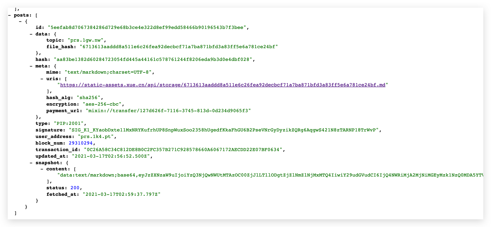

# 如何读取我的 PIP2001 区块？
读取 PIP2001 区块，就是用这两个 API

在上一节我们就有用它们来确定区块是否已经上链完成。这一节将为你仔细介绍这两个 API 要怎么用。

## 什么情况下我需要读取链上的数据？
上链是需要时间的。一个区块预计需要 5 - 10 分钟后确认。

当你提交一个区块，你需要通过轮询的方法，去读取链上的数据，以确定是否上链成功了。

能读取到就说明上链完成了。

另外一个情况就是当别人想要聚合你这个站点文章，你可以把同步 API 发给他，他就可以从链上把你站点的内容全部同步下来，聚合到他的站点。所以这两个 API 就有点像 RSS 订阅源。

同步区块有两个 API，一个是同步用户，一个是同步文章。

## 同步你的站点在链上的所有授权用户
`https://prs-bp-cn1.xue.cn/api/pip2001/{developer.account}/authorization`

|参数|作用|
|-------------|-------------|
|count|每一页的数量|
|updated_at|开始的时间|

用着两个参数，你就可以做分页了，每次把最后一条数据的 `updated_at` 保存起来，作为下一次的起点，直到全部数据都拉取完毕。

下面为你介绍返回结果的数据格式，以及你需要做什么。

**授权区块**

`status` 是 `allow`，你需要需要在数据库层面，把用户的状态更新为 `allow`，也就是允许发文章

**取消授权区块**

`status` 是 `deny`，你需要需要在数据库层面，把用户的状态更新为 `deny`，也就是禁止发文章，而且你需要把 Ta 已发布的文章，从数据库中全部删除，或者设置为不可见。

## 同步你的站点在链上的所有文章
`https://prs-bp-cn1.xue.cn/api/pip2001`

|参数|作用|
|-------------|-------------|
|topic|开发者账户名，developer.account|
|count|每一页的数量|
|updated_at|开始的时间|

下面为你介绍返回结果的数据格式，以及你需要做什么。

**新建文章区块**

可以看到大部分都是 `block` 的数据，在之前都已经介绍过了。这里我们需要特别关注一下 `snapshot`，它就是抓取文章内容的结果。

|字段|含义|
|-------------|-------------|
|content|这篇文章的内容，格式为 base64|
|status|状态，200 是正常，0是不正常或者空内容|
|fetched_at|文章的内容是在什么时候拉取的|

在同步数据的时候，你也需要在数据库层面，新建这篇文章。

**修改文章区块**

由于区块本身是不能修改的，所以修改文章就是发布一个新区块，指向一个旧区块，起到了覆盖或者替换的效果。

如果是更新区块，那么区块的 data 里面会有 `updated_tx_id` 字段，表示它要覆盖掉之前的某篇文章。

在同步数据的时候，你也需要在数据库层面，实现这个关联。比如当用户打开旧文章链接时，会自动重定向到最新的文章。

**删除文章区块**

由于区块只能添加，不能删除。所以删除文章就是：发布一个空内容，指向一个要被删除的文章区块

同样的，如果是删除区块，那么区块的 data 也会有 `updated_tx_id` 字段，表示它要删除掉之前的某篇文章。

由于这个区块的内容是空的，所以 `content` 是空数组，`status` 是 0

在同步数据的时候，你需要在数据库层面，删除掉这篇文章。

## 同步区块需要 5-10 分钟，会不会影响用户体验？
我们不希望用户提交一个区块，然后等 5-10 分钟，才能看到文章，这个体验很差。

所以我们建议核心的业务逻辑，与区块的提交和同步是分开的。

业务逻辑就是直接写数据库，和传统的方式一样，用户发布文章，立马就能看到了。后台就是写一下数据库而已，不需要等待。

而区块的提交和同步，应该交给异步队列去做。整个上链和同步的过程，对于用户发布文章、修改文章最好是无感知的。用户就像在使用传统的写作产品一样。只是在需要用到区块交易，用户才需要等待上链完成，其他情况是没有必要等的。

## 如果别人想要聚合我的站点，我需要做什么？
1. 把站点的两个 API 发给他，让他按照这篇教程，把整个站点的历史数据灌到他的数据库中
2. 如果你的文章内容有加密，那你要告诉 Ta 解密的方法，因为 API 返回的是加密的内容，而 Ta 需要的是明文，如果内容是明文，那么这一步就不需要（你提交的是加密内容，API 返回就是加密内容；你提交的是明文，API 返回就是明文）
