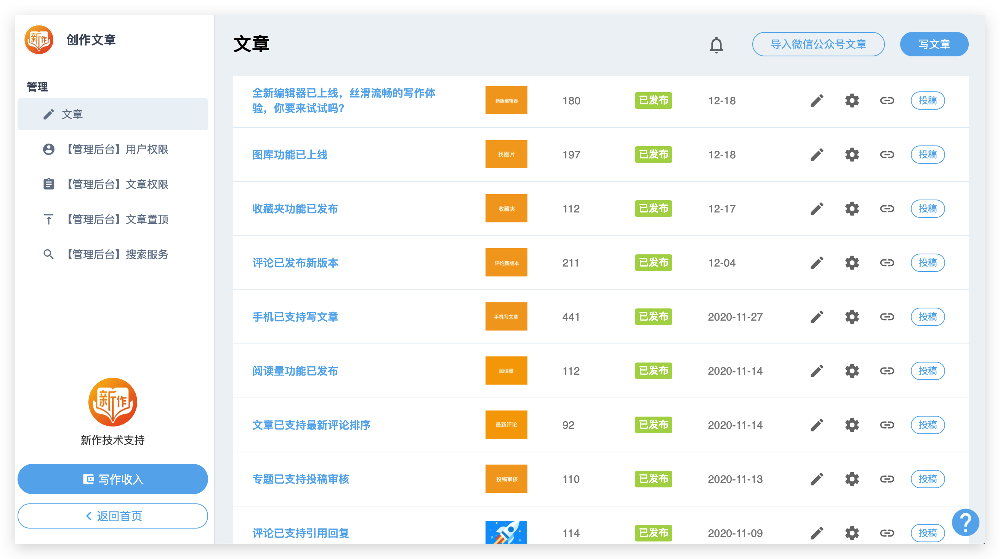

# 介绍

---

## 什么是飞帖？

飞帖是基于 press.one 的 [PIP2001](/PIP2001/) 协议实现的应用。

可以发布文章、阅读文章、打赏、评论。

所有的文章都会提交到 PRS 链上。

## 飞帖产品截图





## 文章提交到链上有什么好处呢？

1. 可以直接在 [PRS 区块浏览器](https://press.one/blockchain/main?type=pip2001) 查看文章的区块信息，从而可以证明某篇文章是你写的。
2. 链上的文章可以使用合约进行各种交易。比如有一个合约是【购买阅读权】，也就是给一篇文章开启付费阅读功能，其他人需要付费才能阅读文章的内容，这个就可以通过合约来实现。

备注：飞帖目前只支持了第 1 点，也就是确定某篇文章是你写的。而第 2 点还未支持，在后续的版本中会开始支持合约功能。

## 飞帖会保存文章内容吗？

飞帖不会保存文章内容，只保存文章的哈希。所以准确来说，其实不是文章上链，而是文章的哈希上链。

文章还是存储在每个站点中，由站点自己保存。

## 正在运行的飞帖站点有哪些？

- 新作：[http://zuopin.xin](http://zuopin.xin/)（目前最多人使用的站点）
- BOX 定投：[https://read.firesbox.com](https://read.firesbox.com/)（定投群会员专享，私密站点）
- PRS 团队动态：[http://blog.prsdev.club](http://blog.prsdev.club/)
- PRESS.one 主站：[https://prs.prsdev.club](https://prs.prsdev.club/)
- 编程自学：[https://xue.prsdev.club](https://xue.prsdev.club/)
- （如果你的站点搭建好了，可以把站点名称和链接发给我们，我们把你的站点加在这里，让大家看见）

## 我可以拥有自己的飞帖站点吗？

可以的。我们非常欢迎你运行自己的飞帖站点，以解决你的写作和沟通需要。

关于如何搭建自己的站点，可以查看：[建站教程](/flying-pub/建站教程)

## 运行站点需要付费吗？

当前每篇文章的上链手续费预估是 0.13 PRS。少量 PRS 即可支撑飞帖站点运行较长时间。

当你的飞帖完成建站后，可向 PRS 项目方申领飞帖数据上链手续费的补贴。

申请方式，发送邮件给：apply@press.one

邮件标题：飞帖上链手续费补贴申请 xxx.yyy.zzz（即你的站点域名）

邮件内容：

```
申请人 mixin ID：123456（用于接收你的PRS补贴）

站点域名：xxx.yyy.zzz

站点简介：你的站点定位/简介，站点所属团队/个人简介等。
```

我们将持续关注你的站点数据情况，并自行决定你的补贴额度。该补贴仅可用于支付站点数据上链的手续费，不可挪作他用。如果你的站点数据不健康，或你把补贴挪作他用，我们将拒绝你的后续补贴申请。

当你的飞帖站点数据量较大，既往补贴即将用完，可再次向我们发起补贴申请。

## 我是一个开发者，我可以做些什么？

非常欢迎你给飞帖贡献代码！

本地开发可以参考：[开发教程](/flying-pub/开发教程)

## 飞帖不满足我的需求，怎么办？

你可以 folk 飞帖的代码，根据自己的需要，修改或者添加功能，然后搭建一个定制化的飞帖。
