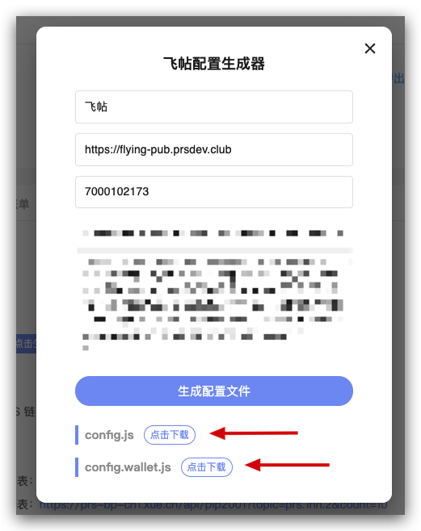

# 如何修改站点的配置？


你在 PRS ATM 生成的这两份配置文件是可以修改、定制的。

`config.js` 是可以修改的。而 `config.wallet.js` 是钱包的配置，一般不需要修改，所以可以忽略。

下面为你介绍 `config.js` 的各个配置项，以及它们的作用，你可以根据自己的需要，进行修改。

## 如何修改？
根据下面介绍的[配置文件详细说明](#配置文件详细说明)，你修改对应的字段，然后保存，再执行：

```
./scripts/redeploy_flying_pub.sh
```

等待服务重启，大概 30 秒后即可生效

## 配置文件详细说明

|字段|作用|
|-------------|-------------|
|debug|是否打印日志，默认关闭|
|sequelizeLogging|是否打印数据库日志，默认关闭|
|serviceRoot|站点域名|
|serviceKey|站点唯一标识，有了这个可以防止一台机器上面跑多个站点不会相互混淆|
|host|后端服务的地址|
|port|后端服务的端口|
|queuePort|队列服务的端口|
|testPort|测试服务的端口|
|favicon|自定义 favicon|
|staticCDN|你可以把静态文件储存到CDN上面，然后通过这个字段，把静态资源的来源指向你的 CDN 服务|
|db|数据库配置|
|redis|redis配置|
|session|session 配置|
|provider|支持的登录方式|
|settings|**[站点配置项，这里改动最频繁，每个站点的自定义需求，基本都是改这个地方](#settings)**|
|auth|[认证、白名单设置](#auth)|
|recommendation|[推荐作者](#recommendation)|
|postView|[阅读量设置](#postView)|
|topic|[一个站点就是一个 topic，这个 topic 拥有唯一的账号和密钥](#topic)|
|encryption|[加密相关的字段](#encryption)|

## settings
|字段|作用|
|-------------|-------------|
|site.name|站点名称|
|site.title|站点的描述，显示在浏览器的 tab|
|site.logo|l站点ogo|
|notification.mixin.enabled|是否开启 Mixin 通知，比如点赞、打赏都会收到 Mixin 通知|
|author.page.enabled|是否开启作者个人主页|
|subscriptions.enabled|是否开启关注功能|
|filter.enabled|是否开启文章筛选器，比如关注、热门、最新|
|filter.type|文章筛选器的默认选中，可以是 POPULARITY 或者 LATEST|
|filter.popularity.enabled|是否开启热门功能|
|filter.dayRangeOptions|热门文章的区间，比如7天内，30天内|
|wallet.currencies|支持的数字货币类型|
|menu.links|自定义菜单，可以添加各种外链|
|permission.isPrivate|是否为私密站点，需要登录才看阅读|
|permission.denyText|没有权限时显示的提示文案|
|permission.denyActionText|遇到用户去做一个事情，比如开通会员|
|permission.denyActionLink|比如开通会员的链接|
|auth.providers|支持的登录方式|
|site.url|站点的链接|

## auth
|字段|作用|
|-------------|-------------|
|tokenKey|设置 cookie 使用的 key|
|whitelist|白名单功能，在白名单里面的用户，不需要经过权限检查就可以使用所有功能，比如 mixin id 是 10000，开启白名单就是 { mixin: [10000] }|

## recommendation
删除这个配置就是关闭掉推荐作者功能

|字段|作用|
|-------------|-------------|
|authors.cachedDuration|每隔多久更新一次推荐作者列表，单位是秒|

## postView
|字段|作用|
|-------------|-------------|
|enabled|是否开启|
|visible|在界面上是否可见|
|ipExpiredDuration|同一个用户，对于同一篇文章，间隔多久可以重复再计入一次阅读量|

## topic
申请了开发者账号，你就能够获得一个站点对应的密钥。这些数据从 PRS-ATM—APP 中获得。

|字段|作用|
|-------------|-------------|
|account|开发者账户名|
|publicKey|公钥|
|privateKey|私钥|
|blockProducerEndpoint|节点数据同步服务的域名|

## encryption
|字段|作用|
|-------------|-------------|
|accountKeystorePassword|站点给每个用户生成 keystore 所使用的密码|
|sessionKeys|后端服务的 session key|
|jwtKey|用来产生 jwt 的 key|
|aesKey256|加密储存用户数据的 key|
|aes256Cbc.key|加密文章的 key|
|aes256Cbc.ivPrefix|加密文章的 key|