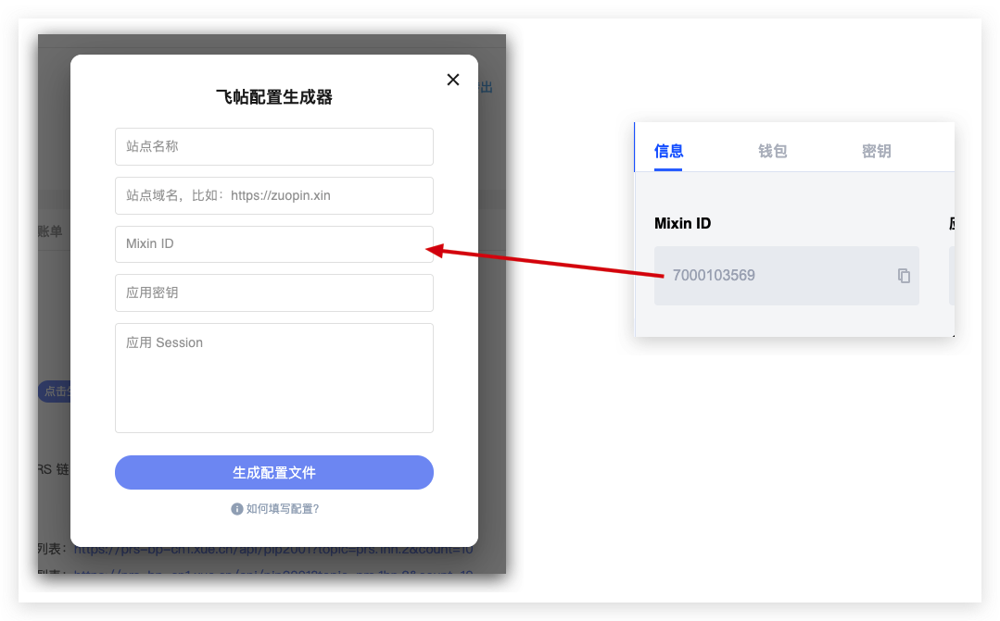
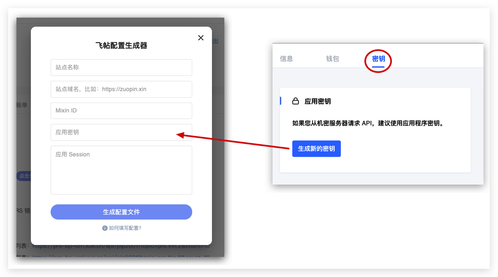
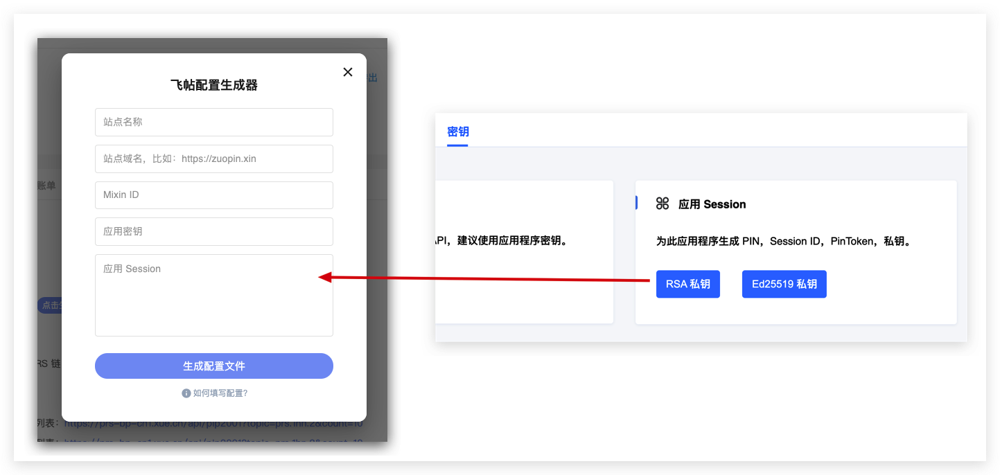

# 如何部署我自己的飞帖站点？

## 你需要准备好两个东西
首先是需要一台服务器（机器），用来部署你的飞帖站点，

其次你需要一个域名，指向上面提到的这台服务器

如何验证我的域名和服务器都已经准备好了？

打开 [Ping 检测工具](https://ping.chinaz.com/)，输入你的域名，监测结果中响应 IP 是你服务器的 IP，那就说明是正确的，域名和服务器准备完毕。

比如 [https://ping.chinaz.com/zuopin.xin](https://ping.chinaz.com/zuopin.xin)


## 创建 Mixin App
为了让你的站点支持数字货币支付，你需要创建一个 Mixin App

打开 Mixin 开发者后台，[https://developers.mixin.one/dashboard](https://developers.mixin.one/dashboard)

创建一个 App

## 下载 PRS ATM 客户端
- Mac 版本，[点击下载](https://static-assets.xue.cn/prs-atm/PRS-ATM-1.0.12.dmg)
- Windows 版本，[点击下载](https://static-assets.xue.cn/prs-atm/PRS-ATM-1.0.12.exe)

## 免费注册开发者账号
打开 PRS ATM，免费注册开发者账号


## 领取 500 PRS 启动资金
一篇文章发布到 PRS 链上，需要节点打包、生产新的区块，才能得到确认。

当你想要把文章发布到 PRS 链上，需要支付 0.13 PRS 的手续费。这个手续费是给节点打包出块的报酬。

不过你放心，PRS 基金会有一个针对飞帖站点的扶持计划。如果你想要运行自己的飞帖站点，你可以添加刘娟娟的 Mixin TODO: id，领取 500 PRS 的启动资金。

## 给开发者账号充值


使用 Mixin 扫码即可充值。

一开始可以先尝试小额充值，比如 10 PRS，等部署完毕，站点开始正常运行时再继续充值。

## 生成飞帖配置文件





点击生成配置文件


把生成的两份配置文件下载到本地，完成

## 登录服务器
登录到你的服务器，下面我们正式开始在服务器上面部署飞帖

## 安装 Docker 和 Docker Compose
你可以根据服务器的系统类型，找到对应的安装方法

比如我的服务器是 Ubuntu 18.04，那么我就按照这两篇教程文章来安装

- [How To Install Docker On Ubuntu 18.04](https://phoenixnap.com/kb/how-to-install-docker-on-ubuntu-18-04)
- [How To Install Docker Compose On Ubuntu 18.04](https://phoenixnap.com/kb/install-docker-compose-ubuntu)
## 获取飞帖部署代码
```
git clone https://github.com/Press-One/flying-pub-setup.git
cd flying-pub-setup
```

## 把配置文件传到目录下面
把刚才在 PRS-ATM 上面生成的两份配置文件传到根目录的 `config` 下面


## 一键启动飞帖
```
./setup.sh
```
这个命令会帮你配置 HTTPS 证书，然后启动服务。

整个过程需要花费几分钟

如果遇到了错误，可以[反馈](/flying-pub/遇到问题了可以找谁咨询？)给我们。

## 验证你的站点
运行

```
docker ps
```

观察 STATUS 那一列，如果显示 UP xxx，那就说明服务是正常运行的

否则可能是出现异常了，可以[反馈](/flying-pub/遇到问题了可以找谁咨询？)给我们。

最后你在浏览器访问你的域名，可以顺利看到飞帖的界面，并且所有功能都正常使用，那么部署就完成啦！

## 如何自定义我的站点？
目前你的站点是使用默认的配置。你可能需要修改一些配置，以满足你的需要，[配置修改和说明可以查看这里](/flying-pub/如何修改站点的配置？)。
## 后续的注意事项

如果 PRS 团队补贴的 500 PRS 用完了，可以尝试找刘娟娟申请新的补贴。

或者你用自己的 PRS 进行充值，以支付上链的开销。
