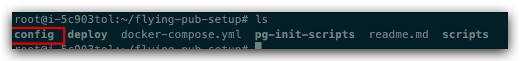

# 飞帖建站教程

本篇教程将引导你一步一步搭建起自己的飞帖站点。如有不清楚的地方，或者遇到任何困难，可以直接[联系我们](/flying-pub/联系我们)来帮助你。

## 你需要准备好两个东西

1. 服务器（机器）
2. 域名

首先是需要一台**服务器**（机器），用来运行你的飞帖站点

服务器的建议是：

1. 系统：推荐 `ubuntu 18.04`
2. 配置：飞帖是轻量级的，一般配置的机器都能跑。比如 1 核、1G 内存、20G 硬盘就足够了

其次你需要一个**域名**，指向上面提到的这台服务器

如何验证你的域名和服务器都已经准备好了？

打开 [Ping 检测工具](https://ping.chinaz.com/)，输入你的域名，监测结果中响应 IP 是你服务器的 IP，那就说明是正确的，域名和服务器就准备好了。

比如 [https://ping.chinaz.com/zuopin.xin](https://ping.chinaz.com/zuopin.xin)


## 创建 Mixin App

为了让你的站点支持 Mixin 登录和数字货币支付，你需要创建一个 Mixin App

打开 Mixin 开发者后台，[https://developers.mixin.one/dashboard](https://developers.mixin.one/dashboard)

创建一个 App，有两个地方需要特别注意：

1. 首页网址需要填你站点的主页，假如你的域名是 a.com，那这里就填 https://a.com
2. 验证网址需要填特定的地址，假设你的域名是 a.com，那这里就填 https://a.com/api/auth/mixin/callback

如下图所示：


域名白名单和沉浸式的填写如下图：


最后点保存，就可以创建 Mixin APP 啦。

## 下载 PRS ATM 客户端

- Mac 版本，[点击下载](https://static-assets.xue.cn/prs-atm/PRS-ATM-1.0.20.dmg)
- Windows 版本，[点击下载](https://static-assets.xue.cn/prs-atm/PRS-ATM-1.0.20.exe)

## 免费注册开发者账号

打开 PRS ATM，免费注册开发者账号


## 设置应用名称

给你的站点起一个名字


## 领取站点补贴

当前每篇文章的上链手续费预估是 0.13 PRS。少量 PRS 即可支撑飞帖站点运行较长时间。

当您的飞帖完成建站后，可向 PRS 项目方申领飞帖数据上链手续费的补贴。

申请方式，发送邮件给：apply@press.one

邮件标题：飞帖上链手续费补贴申请 xxx.yyy.zzz（即你的站点域名）

邮件内容：

```
申请人 mixin ID：123456（用于接收您的PRS补贴）

站点域名：xxx.yyy.zzz

站点简介：您的站点定位/简介，站点所属团队/个人简介等。
```

我们将持续关注你的站点数据情况，并自行决定你的补贴额度。该补贴仅可用于支付站点数据上链的手续费，不可挪作他用。如果你的站点数据不健康，或你把补贴挪作他用，我们将拒绝你的后续补贴申请。

当您的飞帖站点数据量较大，既往补贴即将用完，可再次向我们发起补贴申请。

## 给开发者账号充值


使用 Mixin 扫码即可充值。

一开始可以先尝试小额充值，比如 10 PRS，等搭建完毕，站点开始正常运行时再继续充值。

## 生成飞帖配置文件


你需要打开刚才注册的 Mixin App，把对应的信息填过来


点击生成配置文件


把生成的两份配置文件下载到本地，准备工作都已经完成啦！

## 登录服务器

登录到你的服务器，下面我们正式开始在服务器上面运行飞帖

## 安装 Docker

你可以根据服务器的系统类型，参考对应的安装教程：

- Ubuntu：[安装教程](https://yeasy.gitbook.io/docker_practice/install/ubuntu)
- Debian：[安装教程](https://yeasy.gitbook.io/docker_practice/install/debian)
- CentOS：[安装教程](https://yeasy.gitbook.io/docker_practice/install/centos)

提示：依次完成安装教程里面写的这 4 个步骤即可，忽略其他步骤：

1. 准备工作
2. 使用 APT 安装
3. 启动 Docker
4. 建立 docker 用户组

然后用下面这个方式，测试 Docker 是否安装成功

在命令行输入：

```bash
docker run hello-world
```

输出

```bash
Unable to find image 'hello-world:latest' locally
latest: Pulling from library/hello-world
d1725b59e92d: Pull complete
Digest: sha256:0add3ace90ecb4adbf7777e9aacf18357296e799f81cabc9fde470971e499788
Status: Downloaded newer image for hello-world:latest

Hello from Docker!
This message shows that your installation appears to be working correctly.

To generate this message, Docker took the following steps:
 1. The Docker client contacted the Docker daemon.
 2. The Docker daemon pulled the "hello-world" image from the Docker Hub.
    (amd64)
 3. The Docker daemon created a new container from that image which runs the
    executable that produces the output you are currently reading.
 4. The Docker daemon streamed that output to the Docker client, which sent it
    to your terminal.

To try something more ambitious, you can run an Ubuntu container with:
 $ docker run -it ubuntu bash

Share images, automate workflows, and more with a free Docker ID:
 https://hub.docker.com/

For more examples and ideas, visit:
 https://docs.docker.com/get-started/
```

若能正常输出以上信息，则说明安装成功。

## 安装 Docker Compose

打开[安装教程](https://yeasy.gitbook.io/docker_practice/compose/install#er-jin-zhi-bao)，使用二进制包安装，然后用下面这个方式，测试 Docker Compose 是否安装成功

在命令行输入：

```bash
docker-compose --version
```

输出

```
docker-compose version 1.27.4, build 40524192
```

若能正常输出以上信息，则说明安装成功。

## 获取飞帖的安装代码

```
git clone https://github.com/Press-One/flying-pub-setup.git
cd flying-pub-setup
```

## 把配置文件传到目录下面

把刚才在 PRS-ATM 生成的两份配置文件传到根目录的 `config` 下面



也就是说，这一步需要你把本地电脑的文件，传到服务器上面，一般有两个做法：

假如你是用命令行登录服务器的，那么你可以用 `scp` 命令，比如说

```
scp -r /我本地电脑的目录/config.js 服务器账号@服务器地址:~/flying-pub-setup/config/config.js
scp -r /我本地电脑的目录/config.wallet.js 服务器账号@服务器地址:~/flying-pub-setup/config/config.wallet.js
```

假如你的服务器提供商有配套界面的，那就更容易了，你点下传文件按钮，应该就可以把文件传到这个目录了。

如有困难，可以[联系我们](/flying-pub/联系我们)来帮助你

## 一键启动飞帖

```
./scripts/setup.sh
```

这个命令会帮你配置 HTTPS 证书，然后启动服务。

整个过程需要花费几分钟

如果遇到了错误，可以[联系我们](/flying-pub/联系我们)来帮助你

## 验证你的站点

运行

```
docker ps
```

观察 STATUS 那一列，如果显示 UP xxx，那就说明服务是正常运行的


否则可能是出现异常了，可以[联系我们](/flying-pub/联系我们)来帮助你

最后你在浏览器访问你的域名，可以顺利看到飞帖的界面，并且所有功能都正常使用，那么搭建就完成啦！

## 如何控制你的站点？

为了方便你控制自己的站点，飞帖已经为你准备好了一些快捷命令。

首先你需要进入飞帖目录 `cd flying-pub-setup`，然后根据你的需要，可以选择以下操作：

1. 快速重启站点，执行 `./scripts/redeploy_flying_pub.sh`（比如修改了配置，快速重启就可以让配置生效）
2. 彻底重启站点：执行 `./scripts/deploy.sh`
3. 关闭所有服务：执行 `./scripts/stop.sh`
4. 访问数据库：执行 `./scripts/access_pg.sh`（技术要求高，风险也高，谨慎操作）
5. 备份站点数据：执行 `./scripts/backup.sh`
6. 查看站点日志：执行 `./scripts/log_flying_pub.sh`

## 如何自定义你的站点？

目前你的站点是使用默认的配置。你可能需要修改一些配置，比如站点的名称和 Logo，[配置修改和说明可以查看这里](/flying-pub/配置教程)。

## 后续的注意事项

如果 PRS 项目方的补贴用完了，可再次向我们发起补贴申请。
