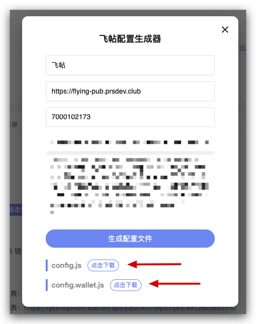
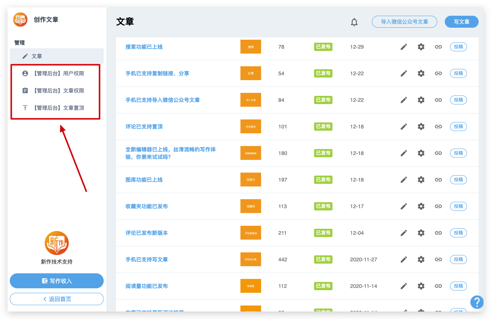

# 飞帖配置教程



你在 PRS ATM 生成的这两份配置文件是可以修改、定制的。

`config.js` 是你需要关注的。而 `config.wallet.js` 是钱包的配置，一般不需要修改，所以可以忽略。

下面为你介绍 `config.js` 的各个配置项，以及它们的作用，你可以根据自己的需要进行修改。

由于配置项非常多，一般来说，改动最频繁的是 [settings](#settings)，你需要重点关注一下，其他的配置你可以先忽略，需要的时候再回来参考。

## 配置文件详细说明

| 字段             | 作用                                                                                  |
| ---------------- | ------------------------------------------------------------------------------------- |
| debug            | 是否打印日志，默认关闭                                                                |
| sequelizeLogging | 是否打印数据库日志，默认关闭                                                          |
| serviceRoot      | 站点域名                                                                              |
| serviceKey       | 站点唯一标识，有了这个可以防止一台机器上面跑多个站点不会相互混淆                      |
| host             | 后端服务的地址                                                                        |
| port             | 后端服务的端口                                                                        |
| queuePort        | 队列服务的端口                                                                        |
| testPort         | 测试服务的端口                                                                        |
| favicon          | 自定义 favicon                                                                        |
| staticCDN        | 你可以把静态文件储存到 CDN 上面，然后通过这个字段，把静态资源的来源指向你的 CDN 服务  |
| db               | 数据库配置                                                                            |
| redis            | redis 配置                                                                            |
| session          | session 配置                                                                          |
| provider         | 支持的登录方式                                                                        |
| settings         | **[站点配置项，这里改动最频繁，每个站点的自定义需求，基本都是改这个地方](#settings)** |
| auth             | [认证、白名单设置](#auth)                                                             |
| recommendation   | [推荐作者](#recommendation)                                                           |
| postView         | [阅读量设置](#postView)                                                               |
| topic            | [一个站点就是一个 topic，这个 topic 拥有唯一的账号和密钥](#topic)                     |
| encryption       | [加密相关的字段](#encryption)                                                         |

## settings

| 字段                        | 作用                                                                                           |
| --------------------------- | ---------------------------------------------------------------------------------------------- |
| site.name                   | 站点名称                                                                                       |
| site.title                  | 站点的描述，显示在浏览器的 tab                                                                 |
| site.logo                   | 站点 logo                                                                                      |
| notification.mixin.enabled  | 是否开启 Mixin 通知，比如点赞、打赏都会收到 Mixin 通知                                         |
| author.page.enabled         | 是否开启作者个人主页                                                                           |
| subscriptions.enabled       | 是否开启关注功能                                                                               |
| filter.enabled              | 是否开启文章筛选器，比如关注、热门、最新                                                       |
| filter.type                 | 文章筛选器的默认选中，可以是 POPULARITY 或者 LATEST                                            |
| filter.popularity.enabled   | 是否开启热门功能                                                                               |
| filter.dayRangeOptions      | 热门文章的区间，比如 7 天内，30 天内                                                           |
| wallet.currencies           | 支持的数字货币类型                                                                             |
| menu.links                  | 自定义菜单，可以添加各种外链                                                                   |
| permission.isPrivate        | 是否为私密站点，如果是，只有白名单里面的用户才能阅读                                           |
| permission.isOnlyPubPrivate | 如果开启，那么所有用户都可以免费阅读，但只有白名单里面的用户才能发文章                         |
| permission.denyText         | 没有权限时显示的提示文案                                                                       |
| permission.denyActionText   | 遇到没权限的用户去做一个事情，比如开通会员                                                     |
| permission.denyActionLink   | 比如开通会员的链接                                                                             |
| auth.providers              | 支持的登录方式                                                                                 |
| site.url                    | 站点的链接                                                                                     |
| mixinApp.name               | Mixin App 的名称，由于 Mixin 在国内无法直接下载，所以我们推荐新生大讲堂，它和 Mixin 是一个东西 |
| mixinApp.downloadUrl        | Mixin App 下载链接                                                                             |
| mixinApp.logo               | Mixin App 的 logo                                                                              |

### auth（权限控制）

| 字段      | 作用                                                                                                                        |
| --------- | --------------------------------------------------------------------------------------------------------------------------- |
| tokenKey  | 设置 cookie 使用的 key                                                                                                      |
| adminList | 管理员功能，管理员会有额外的功能，比如置顶文章、禁止文章等等。比如 mixin id 是 1095057，开启管理员就是 { mixin: [1095057] } |
| whitelist | 白名单功能，当站点是私密，那就只有白名单用户才能使用。比如 mixin id 是 1095057，开启白名单就是 { mixin: [1095057] }         |

### recommendation（推荐作者）

删除这个配置就是关闭掉推荐作者功能

| 字段                   | 作用                                   |
| ---------------------- | -------------------------------------- |
| authors.cachedDuration | 每隔多久更新一次推荐作者列表，单位是秒 |

### postView（阅读量）

| 字段              | 作用                                                         |
| ----------------- | ------------------------------------------------------------ |
| enabled           | 是否开启                                                     |
| visible           | 在界面上是否可见                                             |
| ipExpiredDuration | 同一个用户，对于同一篇文章，间隔多久可以重复再计入一次阅读量 |

### topic（站点密钥）

申请了开发者账号，你就能够获得一个站点对应的密钥。这些数据从 PRS-ATM—APP 中获得。

| 字段                  | 作用                   |
| --------------------- | ---------------------- |
| account               | 开发者账户名           |
| publicKey             | 公钥                   |
| privateKey            | 私钥                   |
| blockProducerEndpoint | 节点数据同步服务的域名 |

### encryption（加密相关）

| 字段                    | 作用                                     |
| ----------------------- | ---------------------------------------- |
| accountKeystorePassword | 站点给每个用户生成 keystore 所使用的密码 |
| sessionKeys             | 后端服务的 session key                   |
| jwtKey                  | 用来产生 jwt 的 key                      |
| aesKey256               | 加密储存用户数据的 key                   |
| aes256Cbc.key           | 加密文章的 key                           |
| aes256Cbc.ivPrefix      | 加密文章的 key                           |

## 如何修改并且让配置生效？

进入飞帖目录 `cd flying-pub-setup`，

修改配置之前，建议先备份数据，执行一遍：`./scripts/backup.sh`

修改 `config.js` 对应的字段，然后保存，再执行：

```
./scripts/redeploy_flying_pub.sh
```

等待服务重启，大概 30 秒后即可生效

## 举例 1：我要修改站点名称

1. 进入飞帖目录 `cd flying-pub-setup`
2. 备份数据，运行 `./scripts/backup.sh`
3. 打开 `config/config.js`
4. 修改 `settings` 里面的 `site.name`
5. 保存
6. 重启服务，运行 `./scripts/redeploy_flying_pub.sh`
7. 等待 20 秒，搞定（服务重启期间，页面显示 502 是正常现象）

## 举例 2：我要修改站点 logo

1. 进入飞帖目录 `cd flying-pub-setup`
2. 备份数据，运行 `./scripts/backup.sh`
3. 打开 `config/config.js`
4. 修改 `settings` 里面的 `site.logo`
5. 保存
6. 重启服务，运行 `./scripts/redeploy_flying_pub.sh`
7. 等待 20 秒，搞定（服务重启期间，页面显示 502 是正常现象）

## 举例 3：我的站点是私密的，只有我允许的人才可以看

1. 进入飞帖目录 `cd flying-pub-setup`
2. 备份数据，运行 `./scripts/backup.sh`
3. 打开 `config/config.js`
4. 修改 `settings` 里面的 `permission.isPrivate` 为 `true`
5. 修改 `auth` 里面的 `whitelist`（白名单），把你允许的用户的 mixin id 填到这里，假如 id 是 1095057，那这里就是 `mixin: [1095057]`，记得把自己加上哦
6. 保存
7. 重启服务，运行 `./scripts/redeploy_flying_pub.sh`
8. 等待 20 秒，搞定（服务重启期间，页面显示 502 是正常现象）

## 举例 4：我要成为管理员

1. 进入飞帖目录 `cd flying-pub-setup`
2. 备份数据，运行 `./scripts/backup.sh`
3. 打开 `config/config.js`
4. 修改 `auth` 里面的 `adminList`（管理员名单），把 mixin id 填到这里，假如 id 是 1095057，那这里就是 `mixin: [1095057]`
5. 保存
6. 重启服务，运行 `./scripts/redeploy_flying_pub.sh`
7. 等待 20 秒，搞定（服务重启期间，页面显示 502 是正常现象）

管理员有哪些额外的功能：


